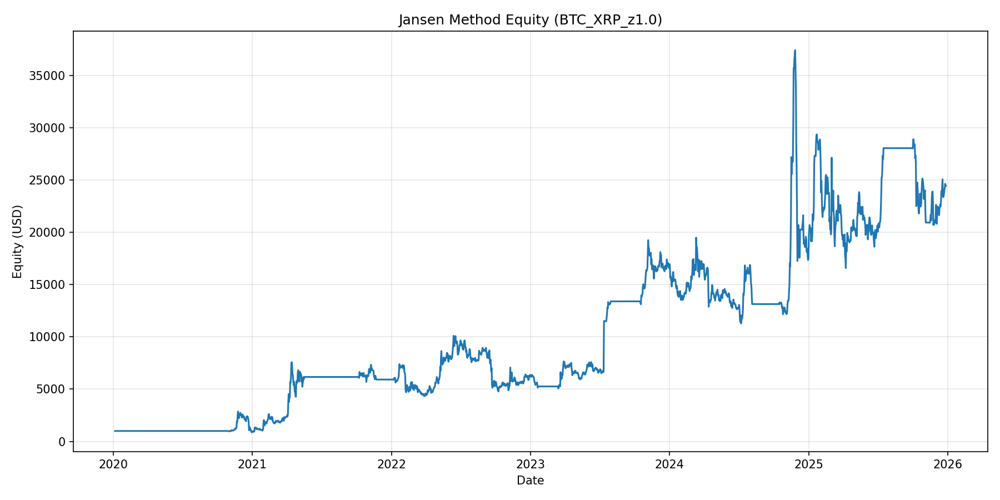

# Jansen Method Pair Trading

This project implements a pairs trading strategy inspired by the "Pairs trading in practice" section of `pair_trading_in_practice.pdf`. It utilizes Kalman filtering to smooth price series and estimate a time-varying hedge ratio. A z-score is built from the resulting spread, and trades are executed when the z-score crosses defined thresholds.

## Features

- **Kalman Filter Smoothing**: Reduces noise in individual price series.
- **Dynamic Hedge Ratio**: Uses a Kalman Filter to estimate the cointegration relationship between two assets in real-time.
- **Mean Reversion Strategy**: Trades the z-score of the spread, entering at `entry_z` and exiting when the z-score changes sign (mean reversion).
- **Rolling Windows**: Recomputes hedge ratio/half-life/z-score quarterly, trades a 6-month window, and only opens trades in the first 3 months.
- **Optimization Tools**: Scripts to sweep z-score thresholds and find the best-performing pairs.
- **Caching**: `pair_sweep.py` uses a signature-based caching mechanism to speed up repeated runs.

## Example Output


## Scripts

### 1. `jansen_backtest.py`
The core backtest engine for a single pair.
```powershell
python jansen_backtest.py
```
It reads `symbol_x` and `symbol_y` from `config.json`, runs the backtest, and saves the results/plots to the `output/` directory.
The backtest recalibrates quarterly using a rolling lookback window.

### 2. `zscore_sweep.py`
Sweeps a grid of z-score thresholds for the pair defined in `config.json`.
```powershell
python zscore_sweep.py --thresholds "1.0,1.5,2.0,2.5,3.0"
```
Useful for finding the optimal entry threshold for a specific pair. It filters results based on `min_trades` and ranks them by `sharpe` ratio.

### 3. `pair_sweep.py`
Ranks all possible pairs from the available data based on their performance.
```powershell
python pair_sweep.py
```
- It filters symbols based on `min_history_days`.
- It tests each pair against the `threshold_grid` defined in `config.json`.
- Results are cached in the `cache/` folder using a SHA-256 signature of the data and code.
- It outputs a ranked table based on `sharpe` ratio (requiring at least `min_trades`) and generates an equity plot for the best-performing pair in `output/`.

## Configuration (`config.json`)

- `data_dir`: Path to the directory containing `.feather` price files.
- `output_dir`: Path where backtest results and plots are saved.
- `interval`: Candle interval (e.g., `1d`).
- `quote`: Quote currency (e.g., `USDT`).
- `symbol_y`: Primary symbol (Lead).
- `symbol_x`: Secondary symbol (Lag/Hedge).
- `start_equity`: Initial capital.
- `entry_z`: Z-score threshold for entering a trade.
- `threshold_grid`: List of z-score thresholds to test in sweep scripts.
- `min_history_days`: Minimum data points required for a symbol to be included in `pair_sweep.py`.
- `min_trades`: Minimum number of trades required for a backtest result to be considered valid in sweep scripts.
- `fee_rate`: Transaction fee rate (e.g., `0.001` for 0.1%).
- `lookback_days`: Rolling lookback (in days) used before each quarterly test window.
- `trade_window_months`: Months traded after each quarterly test end (default 6).
- `entry_window_months`: Months within the trading window where entries are allowed (default 3).
- `show_plot`: Boolean to toggle the display of the equity curve window.

## Installation

Ensure you have the following dependencies installed:

```powershell
pip install pandas numpy pykalman matplotlib pyarrow
```

The data files should be in Feather format with a `close` price column and an `open_time_dt` datetime column.
Files should be named following the pattern `{symbol}{quote}_{interval}.feather` (e.g., `BNBUSDT_1d.feather`).
