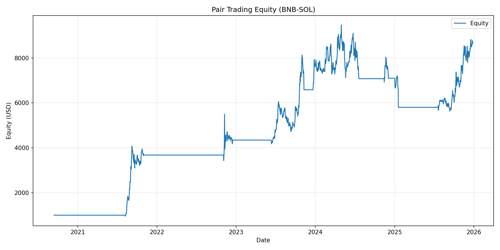

# Pair Trading CARTEA-JAIMUNGAL-PENALVA method, and JANSEN method.

A pair trading strategy implementation using Binance data daily candles (backtest only). The trading strategy utilizes rolling-window cointegration analysis and models the resulting spread using an Ornstein-Uhlenbeck (OU) process to determine optimal trading bands through statistical optimal stopping theory.

It is based on info from the book "ALGORITHMIC AND HIGH-FREQUENCY TRADING" by Cartea and Jaimungal and Penalva, and FrenchQuant videos ( https://youtu.be/_Sq6KoP7m1c?si=2N9ufvkx3fcU7zZe   https://youtu.be/DeqpOFrH_Bg?si=YdeAJMz_xz04e2bd   https://youtu.be/EYRk5nk6eDA?si=dBLKiuJM68GLDys0 ).

Also includes a simpler model based on Jansen's book "Machine Learning for Algorithmic Trading".

## Features

- **Automated Data Management**: Fetches historical klines directly from Binance Futures API.
- **Statistical Calibration**:
    - Rolling window cointegration (Hedge ratio and ADF stationarity tests).
    - OU process parameter estimation using Maximum Likelihood Estimation (MLE) and Method of Moments (MoM).
- **Optimal Trading Bands**: Calculates entry and exit thresholds by solving the optimal stopping problem for a mean-reverting process.
- **Robust Backtesting**: Full backtest engine accounting for transaction fees, and turnover.
- **Visualization**: Generates detailed equity curves saved automatically to the `data/plots` directory.

## Example Equity Curve

<p align="center">
  
</p>

## Project Structure

- `download_data.py`: Handles data ingestion and synchronization.
- `coint_calibrate.py`: Performs rolling cointegration analysis.
- `ou_calibrate.py`: Calibrates the OU process (Kappa, Mu, Sigma).
- `band_calc.py`: Computes optimal entry/exit bands.
- `backtest.py`: Executes the strategy and generates performance reports.
- `run_all.py`: The main entry point to run the full pipeline.
- `rank_coint_pairs.py`: Utility to find the most cointegrated pairs across the market.
- `QuantPy_OU_process/`: Reference implementation of Ornstein-Uhlenbeck (OU) process calibration and simulation using Maximum Likelihood Estimation (MLE).
- `Jansen_method/`: An alternative pairs trading implementation using Kalman Filters for dynamic hedge ratios and z-score thresholds. See [Jansen_method/README.md](Jansen_method/README.md) for detailed documentation.
- `config.json`: Centralized configuration for parameters, pairs, and intervals.
  - `transaction_cost` is used in `band_calc.py` to shift the optimal OU bands.
  - `fee_rate` is used in `backtest.py` to apply turnover-based trading fees.

## Getting Started

### Prerequisites

- Python 3.8+
- Dependencies: `pandas`, `numpy`, `statsmodels`, `scipy`, `matplotlib`, `requests`, `pyarrow`

Install requirements:
```bash
pip install -r requirements.txt
```

### Usage

1. **Configure your pairs**: Edit `config.json` to define the assets you want to trade and your preferred rolling window.
2. **Run the pipeline**:
```bash
python run_all.py
```

Results including processed data and equity plots will be available in the `data/` directory.

## License

MIT
