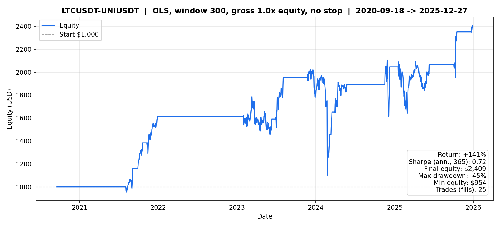
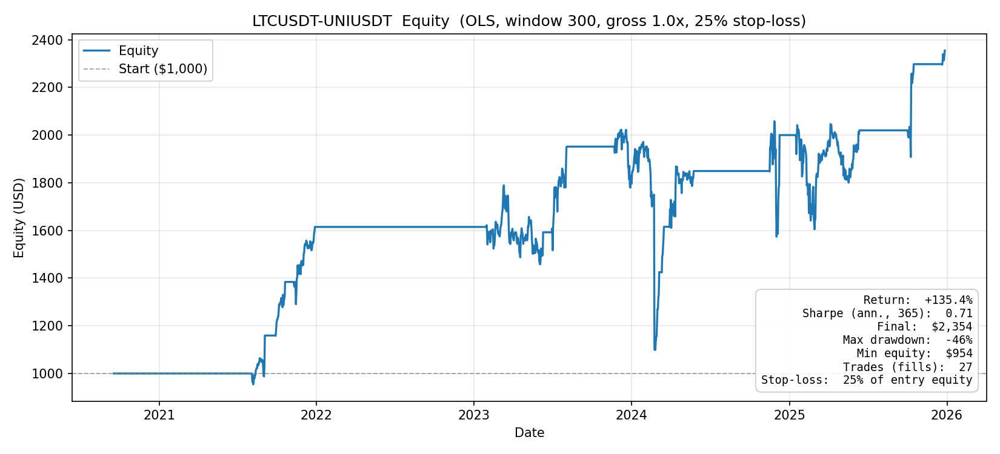

# Pair Trading: CARTEA-JAIMUNGAL-PENALVA Method

A pair trading strategy implementation using Binance data daily candles (backtest only). The trading strategy utilizes rolling-window cointegration analysis and models the resulting spread using an Ornstein-Uhlenbeck (OU) process to determine optimal trading bands through statistical optimal stopping theory.

It is based on info from the book "ALGORITHMIC AND HIGH-FREQUENCY TRADING" by Cartea and Jaimungal and Penalva, and FrenchQuant videos ( https://youtu.be/_Sq6KoP7m1c?si=2N9ufvkx3fcU7zZe   https://youtu.be/DeqpOFrH_Bg?si=YdeAJMz_xz04e2bd   https://youtu.be/EYRk5nk6eDA?si=dBLKiuJM68GLDys0 ).

## Features

- **Automated Data Management**: Fetches historical klines directly from Binance Futures API.
- **Statistical Calibration**:
    - Rolling window cointegration (Hedge ratio and ADF stationarity tests).
    - **Bayesian Rolling Regression**: Dynamic hedge ratio estimation using PyMC with random-walk coefficients (ADVI or NUTS inference).
    - OU process parameter estimation using Maximum Likelihood Estimation (MLE) and Method of Moments (MoM).
- **Optimal Trading Bands**: Calculates entry and exit thresholds by solving the optimal stopping problem for a mean-reverting process.
- **Robust Backtesting**: Full backtest engine accounting for transaction fees and turnover.
- **Capital-Normalized Sizing & Risk Controls**: Positions sized to a target gross leverage of current equity (no fixed-unit blow-ups), with optional equity-drawdown stop-loss and daily rehedging.
- **Pair Ranking**: Automated ranking of cointegrated pairs across the market (by Sharpe or absolute return).
- **Visualization**: Generates detailed equity curves saved automatically to the `data/plots` directory.

## Example Equity Curve — Best Backtested Pair (`LTCUSDT-UNIUSDT`)

`LTCUSDT-UNIUSDT` was the **top pair by Sharpe in the full 91-pair OLS sweep** (`run_and_rank.py`). Backtested on daily candles over **2020-09-18 → 2025-12-27** with a 300-day rolling window, gross notional sized to **1.0× current equity**, no stop-loss, and 10 bps fees:

<p align="center">
  
</p>

| Return | Sharpe (ann., 365) | Final equity | Max drawdown | Min equity | Trades (fills) |
|:------:|:------------------:|:------------:|:------------:|:----------:|:--------------:|
| **+141%** | **0.72** | $2,409 (from $1,000) | −45% | $954 | 25 |

> These are **in-sample** results over the full history with no walk-forward — treat the pair as a screening result, not a validated live edge. Across the 91-pair sweep only ~10 pairs were solidly profitable and solvent, so the edge is concentrated. Adding a 25% equity-drawdown stop barely changes this pair (`stop_loss_frac` rarely triggers) but, across the whole universe, cuts pairs that end insolvent from 29 → 2.

## Example Equity Curve — Best Pair with a 25% Stop-Loss (`LTCUSDT-UNIUSDT`)

Re-running the **same 91-pair sweep with a 25% equity-drawdown stop** (`stop_loss_frac = 0.25`) leaves `LTCUSDT-UNIUSDT` on top of the Sharpe ranking. The stop barely touches this particular pair, but it is what makes the *leaderboard itself* trustworthy (see note below):

<p align="center">
  
</p>

| Return | Sharpe (ann., 365) | Final equity | Max drawdown | Min equity | Trades (fills) |
|:------:|:------------------:|:------------:|:------------:|:----------:|:--------------:|
| **+135%** | **0.71** | $2,354 (from $1,000) | −46% | $954 | 27 |

> The 25% stop **barely changes this winner** (no-stop +141% / 0.72 → +135% / 0.71; this pair's per-trade loss rarely reaches 25%). Its real value is **portfolio-wide**: across the full 91-pair sweep it cuts pairs that end **insolvent from 29 → 2** (worst final equity −$9,845 → −$369) and demotes the high-Sharpe *volatility-drag mirages* (e.g. `DOGEUSDT-XRPUSDT`, `ADAUSDT-BCHUSDT`, which blew through zero but had their post-ruin returns masked) out of the top ranks. So for a single hand-picked pair the stop is roughly irrelevant; for **screening/ranking many pairs it makes the rankings honest**.

## Project Structure

### Core Pipeline
- `download_data.py`: Handles data ingestion and synchronization from Binance Futures API.
- `coint_calibrate.py`: Performs rolling OLS cointegration analysis with ADF tests.
- `bayesian_coint.py`: Bayesian rolling hedge ratio calibration using PyMC (alternative to OLS).
- `rolling_bayesian_hedge.py`: Bayesian random-walk regression engine with ADVI/NUTS inference.
- `ou_calibrate.py`: Calibrates the OU process parameters (Kappa, Mu, Sigma).
- `band_calc.py`: Computes optimal entry/exit bands via optimal stopping theory.
- `backtest.py`: Executes the strategy and generates performance reports.

### Orchestration
- `run_all_one_pair.py`: Main entry point to run the full pipeline sequentially for the configured pair(s).
- `run_and_rank.py`: Bulk sequential backtest runner and ranking across all available symbols.

### Utilities
- `utils.py`: Shared utilities for data loading, path management, and configuration.
- `rank_coint_pairs.py`: Find the most cointegrated pairs across the market.
- `rank_backtests.py`: Summarize and rank backtest results.

### Reference
- `QuantPy_OU_process/`: Reference implementation of OU process calibration using MLE.
- `pair_trading_video*_frenchquant.py`: Educational scripts from FrenchQuant video tutorials.

### Configuration
- `config.json`: Centralized configuration for parameters, pairs, and intervals.
  - `cointegration_method`: `"ols"` (rolling OLS hedge ratio + ADF) or `"bayesian"` (rolling Bayesian random-walk regression).
  - `ranking_metric`: `"sharpe"` or `"returns"` — the metric `run_and_rank.py` ranks pairs by.
  - `sizing_mode` / `target_gross_leverage`: position sizing. In `"gross"` mode the gross notional `|m1·Py| + |m2·Px|` is set to `target_gross_leverage × current equity` (`1.0` = fully invested, no leverage). `"legacy_unit"` reproduces the old fixed 1-unit-of-Y behaviour.
  - `stop_loss_frac` / `rehedge_daily`: optional risk controls. `stop_loss_frac` (e.g. `0.25`, `null`/`0` = off) force-flats a position once its open mark-to-market loss exceeds that fraction of entry equity; `rehedge_daily` refreshes the X leg to `-beta_t · m1` each bar to track the current hedge ratio (pays extra fees).
  - `transaction_cost`: Used in `band_calc.py` to shift the optimal OU bands. **Units: absolute spread/residual (price) units** (subtracted directly from the band level).
  - `fee_rate`: Used in `backtest.py` to apply turnover-based trading fees. **Units: a fraction of traded notional** (e.g. `0.001` = 10 bps). These two are different units despite often sharing a value.
  - `bayesian_config.inference_method`: Choose `"advi"` (fast) or `"nuts"` (precise) for Bayesian calibration.

## Getting Started

### Prerequisites

- Python 3.9+
- Dependencies: `pandas`, `numpy`, `statsmodels`, `scipy`, `matplotlib`, `requests`, `pyarrow`, `pymc`, `tqdm`

Install requirements:
```bash
pip install -r requirements.txt
```

> **Note**: PyMC requires a C compiler for PyTensor. On Windows, install Visual Studio Build Tools. On Linux/Mac, ensure `gcc` is available.

### Usage

1. **Configure your pairs**: Edit `config.json` to define the assets you want to trade and your preferred rolling window.
2. **Run the pipeline**:
```bash
python run_all_one_pair.py
```

Results including processed data and equity plots will be available in the `data/` directory.

## License

MIT
